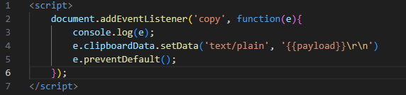

# copy_and_paste
A pastejacking attack is a cybercrime technique where malicious code is copied and pasted into a user's computer without their knowledge, causing the code to run. 
# demo website 
https://darkblackorganization.github.io/copy_and_paste/

# code 

